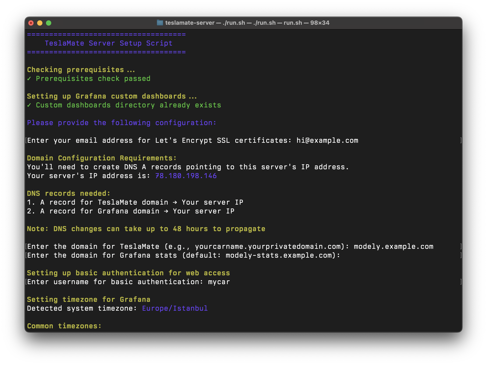

# TeslaMate Server Wizard

A simple, automated setup script for hosting your own TeslaMate server to track your Tesla vehicle data privately.



## 🎯 What You'll Get

### 📊 Real-Time Vehicle Tracking
- See your Tesla's location on a map (like Find My iPhone, but for your car)
- Monitor battery level, range, and charging status from anywhere
- Get alerts when charging completes
- Track if doors are locked, windows are open, or climate is on

### 📈 Detailed Analytics & Reports
- **Driving Stats**: How far you drive daily/monthly/yearly
- **Efficiency Tracking**: Miles per kWh (like MPG for electric cars)
- **Cost Analysis**: How much you spend on charging
- **Battery Health**: Monitor battery degradation over time
- **Speed & Acceleration**: Track your driving habits

### 🔋 Charging Intelligence
- Complete charging history with costs
- See which chargers you use most
- Track charging speed and efficiency
- Compare home vs. Supercharger costs
- Monitor vampire drain (battery loss while parked)

### 📍 Location Features
- Automatic trip logging with start/end addresses
- Frequently visited places
- Parking location history
- Geofencing (know when your car enters/leaves areas)

### 🤖 AI Assistant Integration (Optional)
- Ask questions in plain English: "How far did I drive last month?"
- Get insights: "What's my average efficiency in cold weather?"
- Query your data naturally through Claude or other AI assistants

### 🔐 Privacy First
- **Your data stays on YOUR server** - not in Tesla's cloud
- No third-party access to your driving habits
- Complete control over your information
- Secure encrypted connections

### 📱 Access From Anywhere
- Beautiful web dashboard accessible from any device
- No app installation needed - works in your browser
- Mobile-friendly interface
- Real-time updates

## 🚨 Important: Tesla Provider Restrictions

**Tesla blocks many popular cloud providers!**

- ❌ **Blocked providers**: DigitalOcean, Amazon AWS, Google Cloud, Microsoft Azure, and most major cloud providers
- ✅ **What works**: Your home computer, local/regional VPS providers, or smaller hosting companies

**Don't worry!** Our installer automatically checks if your server is compatible with Tesla.

## 📋 Prerequisites

### 1. A Compatible Server
- Ubuntu 20.04+ server (or similar Debian-based Linux)
- Minimum 2GB RAM, 10GB storage
- A server that isn't blocked by Tesla (our installer will check this for you)
- Your own computer with port forwarding is also an option

### 2. Your Own Domain
- You need to own a domain (e.g., `yourdomain.com`)
- Access to your domain's DNS settings
- You'll create two subdomains during setup

### 3. That's It!
- Our installer handles everything else automatically
- No need to manually install Docker, Git, or other software
- Just need SSH access to your server (we'll guide you through user setup if needed)

## 🚀 Quick Start

**Setup time: ~10 minutes**

### Step 1: Connect to Your Server

Most VPS providers give you root access by default.

**For Windows users:**
1. Download [PuTTY](https://www.putty.org/)
2. Enter your server's IP address
3. Click "Open" and login (usually as `root`)

**For Mac/Linux users:**
```bash
ssh root@your-server-ip
```

### Step 2: Create a User (If Logged in as Root)

Most VPS providers give you root access. If you're logged in as root, create a regular user first:

```bash
# Create a new user (replace 'tesla' with your preferred username)
adduser tesla

# Add the user to sudo group
usermod -aG sudo tesla

# Switch to the new user
su - tesla
```

**Note**: Remember the password you set - you'll need it for sudo commands!

### Step 3: One-Line Installation

Run this single command to install everything:

```bash
curl -fsSL https://raw.githubusercontent.com/f/teslamate-server-wizard/master/install.sh | bash
```

This will:
- ✅ Check if Tesla blocks your server
- ✅ Install Docker and Git
- ✅ Set up permissions
- ✅ Download the TeslaMate setup wizard

**Important**: After installation completes, you MUST logout and login again:
```bash
exit
```

Then reconnect to your server as your regular user (not root):
```bash
ssh tesla@your-server-ip
```

### Step 4: Run the Setup Wizard

After logging back in (as your regular user, not root), run:

```bash
cd teslamate-server
./run.sh
```

The script will ask you for:

1. **Email address**: For SSL certificates (Enter your real email)
2. **TeslaMate domain**: e.g., `mycar.yourdomain.com`
3. **Stats domain**: Will suggest `mycar-stats.yourdomain.com` (just press Enter to accept)
4. **Username**: Choose any username for web access (your secure password will be generated)
5. **Timezone**: Select your timezone from the list or press Enter for default
6. **MCP Server** (optional): Install AI integration for Claude Desktop and other AI assistants

### Step 5: Configure Your Domain DNS

After the script completes, it will show your server's IP address. You need to:

1. **Login to your domain provider** (GoDaddy, Namecheap, Cloudflare, etc.)
2. **Add two DNS A records:**

   | Type | Name | Value | TTL |
   |------|------|-------|-----|
   | A | mycar | YOUR-SERVER-IP | 3600 |
   | A | mycar-stats | YOUR-SERVER-IP | 3600 |

   (Replace `mycar` with your chosen subdomain and YOUR-SERVER-IP with the IP shown by the script)

3. **Wait**: DNS changes can take 15 minutes to 48 hours to work everywhere

**Note**: If you install the MCP server, it will be accessible at `http://yourcarname.yourdomain.com:8888/mcp` (no additional DNS record needed)

### Step 6: Start TeslaMate

If you didn't start the services during setup:

```bash
cd teslamate-server
docker compose up -d
```

Check if everything is running:
```bash
docker compose ps
```

All services should show as "running" or "healthy".

**Important**: If you installed MCP with a domain, open port 8888 in your firewall:
```bash
# For Ubuntu/Debian with UFW
sudo ufw allow 8888/tcp

# For CentOS/RHEL with firewalld
sudo firewall-cmd --permanent --add-port=8888/tcp
sudo firewall-cmd --reload
```

### Step 7: Get Tesla Authentication Tokens

You need to generate tokens to connect your Tesla:

**Option 1 - Easy (iPhone/Mac users):**
1. Download [Auth app for Tesla](https://apps.apple.com/us/app/auth-app-for-tesla/id1552058613) on your iPhone/Mac
2. Login with your Tesla account
3. The app will show your tokens

**Option 2 - Advanced (Windows/Linux users):**
1. Download [Tesla Auth](https://github.com/adriankumpf/tesla_auth/releases) for your system
2. Run the program and login
3. Copy the generated tokens

### Step 8: Connect Your Tesla to TeslaMate

1. Open your browser and go to `https://mycar.yourdomain.com`
2. Login with the username and password shown during setup
3. Paste your Tesla tokens
4. Save the configuration

## 📊 Access Your Data

- **TeslaMate**: `https://mycar.yourdomain.com` - Main interface
- **Grafana Stats**: `https://mycar-stats.yourdomain.com` - Beautiful dashboards
  - First login: Username `admin`, Password `admin` (you'll be asked to change it)

## 🔒 Security Notes

- Your credentials are saved in `credentials.txt` - keep this file safe!
- The script generates strong random passwords
- All connections use HTTPS encryption
- Your Tesla data stays on your own server

## 🛠️ Troubleshooting

### Installation Issues
- **"Don't run as root" error**: Create a regular user first (see Step 2)
- **Permission denied**: Make sure you're using a regular user with sudo privileges, not root
- **Docker issues**: The installer adds you to the docker group - make sure you logged out and back in
- **Re-run installer**: You can safely run the installer again if needed

### "Connection Refused" Error
- DNS might not have propagated yet (wait up to 48 hours)
- Check if services are running: `docker compose ps`
- View logs: `docker compose logs -f`

### "403 Forbidden" from Tesla
- Your server is blocked by Tesla (the installer checks this)
- You need to use a different server/provider

### Can't Access the Websites
1. Check DNS records are correct
2. Ensure ports 80 and 443 are open on your server

### Can't Access MCP Server
1. Ensure port 8888 is open on your server firewall
2. Check if MCP service is running: `docker compose ps teslamate-mcp`
3. Test with curl using the auth token from credentials.txt

### Forgot Credentials
- Check the `credentials.txt` file: `cat teslamate-server/credentials.txt`

## 🔄 Updating TeslaMate

```bash
cd teslamate-server
docker compose pull
docker compose up -d
```

## 🛑 Stopping TeslaMate

```bash
cd teslamate-server
docker compose down
```

To stop only specific services:
```bash
# Stop only TeslaMate (keep database running)
docker compose stop teslamate

# Stop only MCP server
docker compose stop teslamate-mcp
```

## 💾 Backup Your Data

The database is stored in Docker volumes. To backup:

```bash
# Create backup directory
mkdir ~/teslamate-backups

# Backup database
docker exec teslamate-server-database-1 pg_dump -U teslamate teslamate > ~/teslamate-backups/backup-$(date +%Y%m%d).sql
```

## 🤖 AI Integration (MCP Server)

If you chose to install the MCP server during setup, you can now use AI assistants to query your Tesla data!

**Access URL**: The MCP server runs on port 8888 of your TeslaMate domain (e.g., `http://mycar.yourdomain.com:8888/mcp`)

### What is MCP?

The Model Context Protocol (MCP) server allows AI assistants like Claude to directly query your TeslaMate database. You can ask natural language questions like:
- "What's my Tesla's current battery level?"
- "Show me my monthly driving summary"
- "How efficient was my driving last week?"
- "Where do I charge most frequently?"

### Setting up Claude Desktop

**Prerequisites**: Install [Node.js](https://nodejs.org/) on your local computer (not the server)

1. Open Claude Desktop configuration file:
   - **macOS**: `~/Library/Application Support/Claude/claude_desktop_config.json`
   - **Windows**: `%APPDATA%\Claude\claude_desktop_config.json`

2. Copy the configuration from your `credentials.txt` file (it includes your unique auth token)

3. Restart Claude Desktop

4. You can now ask Claude about your Tesla data!

### MCP Features

The MCP server provides 20+ tools for querying:
- Vehicle information and status
- Battery health and degradation
- Driving patterns and efficiency
- Charging history and locations
- Custom SQL queries (read-only)

### Testing MCP Server

Check if the MCP server is running:
```bash
curl -H "Authorization: Bearer YOUR_AUTH_TOKEN" http://localhost:8888/mcp
```
(Replace YOUR_AUTH_TOKEN with the token from credentials.txt)

### Remote Access

The setup script automatically configures remote access:
- **With domain**: MCP is accessible at `http://yourcarname.yourdomain.com:8888/mcp`
- **Without domain**: MCP is only accessible locally at `http://localhost:8888/mcp`

The script automatically handles port binding based on your configuration.

Learn more: [TeslaMate MCP Documentation](https://github.com/cobanov/teslamate-mcp)

## 🆘 Getting Help

1. Check TeslaMate documentation: https://docs.teslamate.org/
2. TeslaMate GitHub issues: https://github.com/adriankumpf/teslamate/issues
3. TeslaMate Discord community
4. MCP Server issues: https://github.com/cobanov/teslamate-mcp/issues

## 📝 Notes

- This setup uses Traefik for automatic SSL certificates
- PostgreSQL database for data storage
- Grafana for visualization
- Mosquitto for real-time updates
- All services run in Docker containers for easy management

---

Remember: Your Tesla data is precious. This setup ensures you own and control your vehicle's data privately on your own server! 
